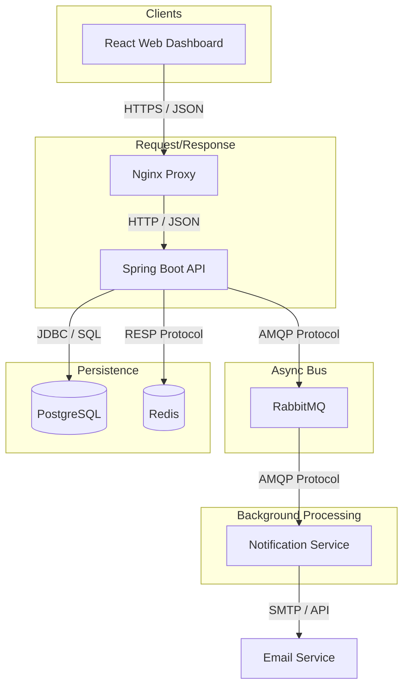

```mermaid
graph TD
    subgraph Clients
        Web[React Web Dashboard]
    end

    subgraph API_Layer [Request/Response]
        Nginx[Nginx Proxy]
        MainAPI[Spring Boot API]
    end

    subgraph Messaging [Async Bus]
        Queue[RabbitMQ]
    end

    subgraph Workers [Background Processing]
        NotifWorker[Notification Service]
    end

    subgraph Data_Layer [Persistence]
        DB[(PostgreSQL)]
        Cache[(Redis)]
    end

    %% Flows with Protocols
    Web -->|HTTPS / JSON| Nginx
    Nginx -->|HTTP / JSON| MainAPI
    
    MainAPI -->|JDBC / SQL| DB
    MainAPI -->|RESP Protocol| Cache
    
    %% Messaging Flow
    MainAPI -->|AMQP Protocol| Queue
    Queue -->|AMQP Protocol| NotifWorker
    NotifWorker -->|SMTP / API| Email[Email Service]
```