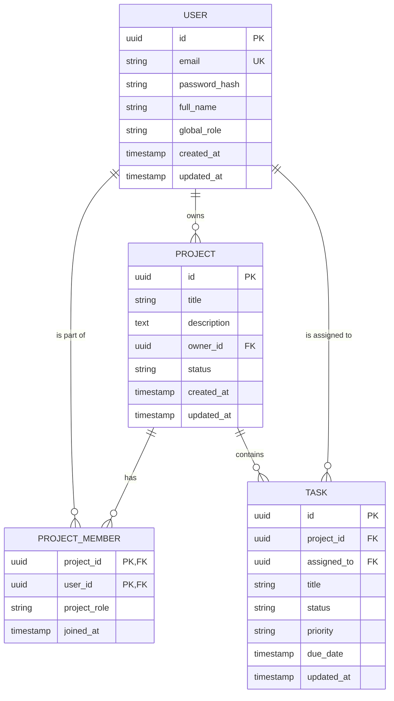

```mermaid
erDiagram
    USER ||--o{ PROJECT : "owns"
    USER ||--o{ PROJECT_MEMBER : "is part of"
    PROJECT ||--o{ PROJECT_MEMBER : "has"
    PROJECT ||--o{ TASK : "contains"
    USER ||--o{ TASK : "is assigned to"

    USER {
        uuid id PK
        string email UK
        string password_hash
        string full_name
        string global_role
        timestamp created_at
        timestamp updated_at
    }

    PROJECT {
        uuid id PK
        string title
        text description
        uuid owner_id FK
        string status
        timestamp created_at
        timestamp updated_at
    }

    TASK {
        uuid id PK
        uuid project_id FK
        uuid assigned_to FK
        string title
        string status
        string priority
        timestamp due_date
        timestamp updated_at
    }

    PROJECT_MEMBER {
        uuid project_id PK, FK
        uuid user_id PK, FK
        string project_role
        timestamp joined_at
    }
```