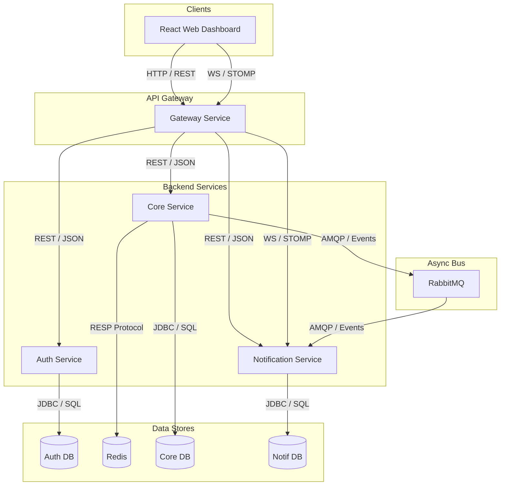

## Port Layout

| Service | Port | Responsibility |
|---------|------|---------------|
| Frontend (Vite) | 5173 | React dashboard, proxies /api to 8080, /ws to 8080 |
| Gateway | 8080 | Routing, JWT validation, CORS, WebSocket proxy |
| Core | 8081 | Business logic (projects, tasks, sprints, stages) |
| Auth | 8082 | User management, authentication, JWT issuance |
| Notification | 8083 | Notifications CRUD, WebSocket push |
| PostgreSQL (core) | 5432 | Business data |
| PostgreSQL (auth) | 5434 | User credentials |
| PostgreSQL (notif) | 5435 | Notifications |
| RabbitMQ | 5672 | Async events (user sync, notifications) |
| Redis | 6379 | Cache, rate limiting |

## Communication Patterns

- **REST (HTTP)**: Gateway proxies to services by path prefix. Downstream services trust `X-User-*` headers set by gateway.
- **WebSocket**: Upgraded through gateway at `/ws`. Gateway injects JWT into STOMP CONNECT frame.
- **Async (RabbitMQ)**: Core → Notification (notification events).

## Security Model

1. Browser sends JWT as HttpOnly `accessToken` cookie (set by auth-service)
2. Gateway validates JWT, strips cookie, forwards `Authorization: Bearer` + `X-User-{Id,Email,Role}` headers
3. Core-service and notification-service trust gateway headers via `GatewayTokenFilter` (no JWT validation)
4. Auth-service validates JWT itself (it issues them)

---

> **Previous version (5 April 2026 — Monolith + Nginx):** [architecture_5April26.md](architecture_5April26.md)
