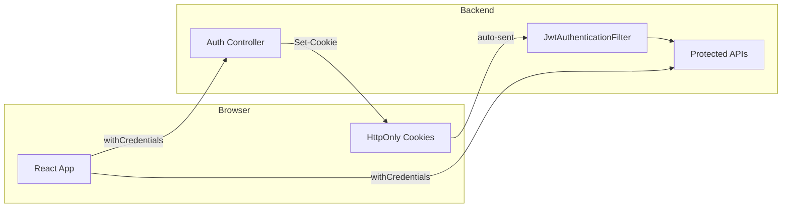
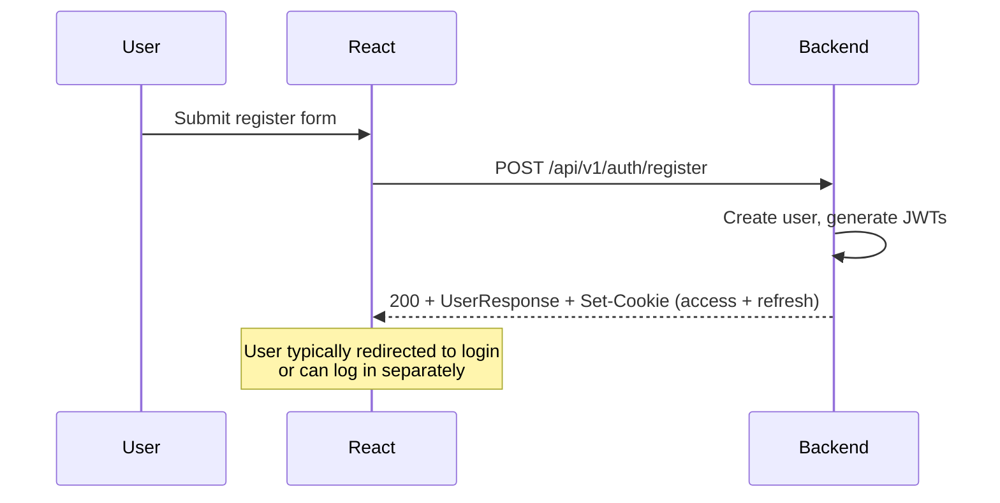
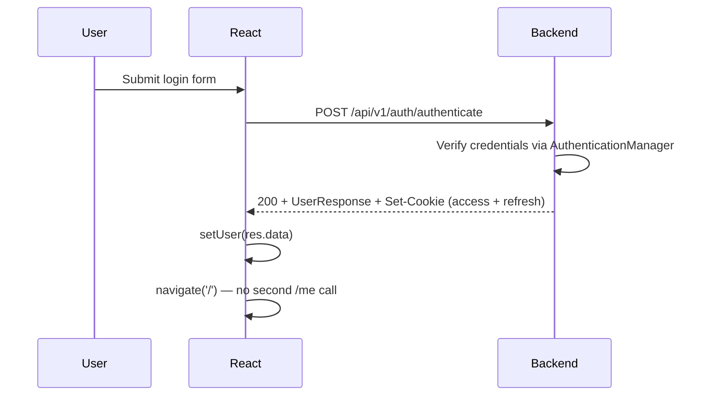
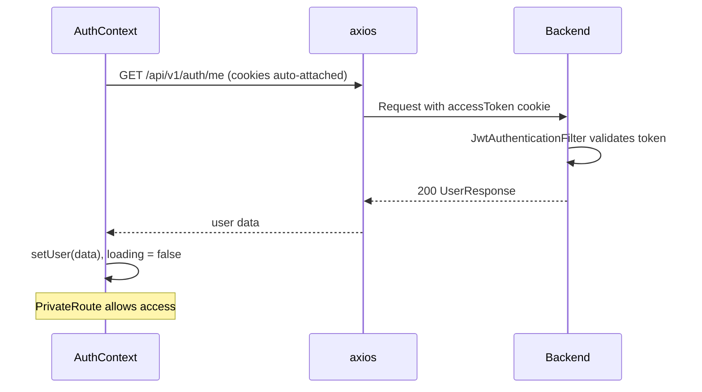
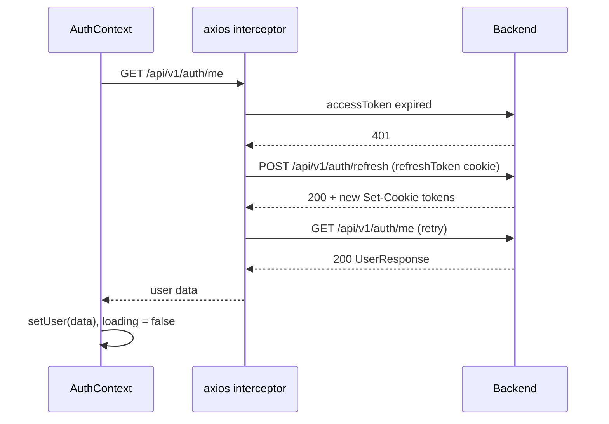
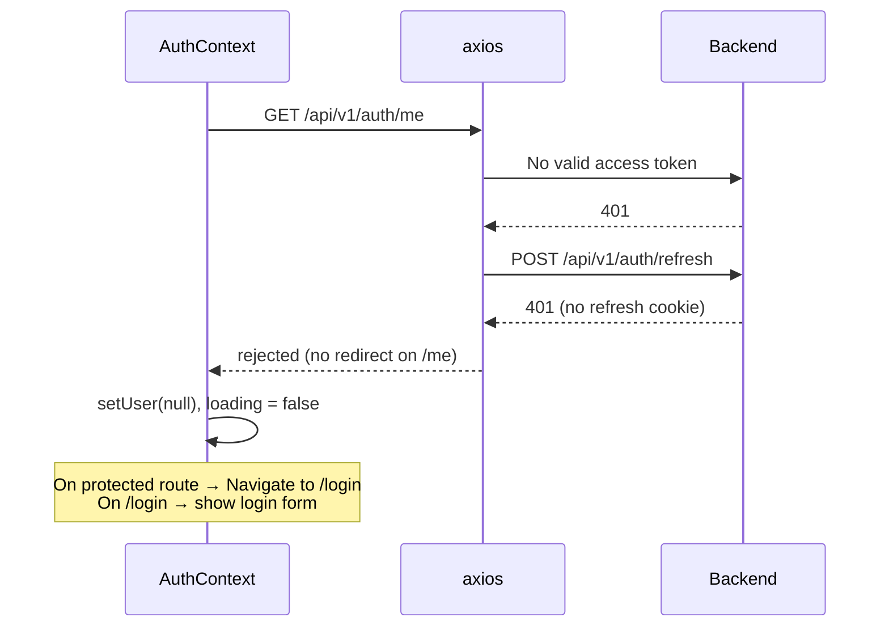
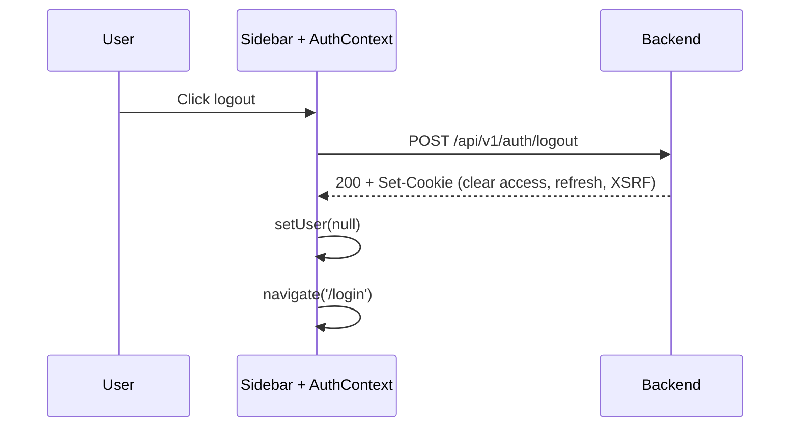

# WorkHub Authentication Flow

This document describes how users sign in, stay signed in, and sign out across the React frontend and Spring Boot backend.

For role-based access after login, see [authorization_model.md](./authorization_model.md).

---

## Overview

WorkHub uses **stateless JWT authentication** with tokens stored in **HttpOnly cookies**. The browser sends cookies automatically; JavaScript cannot read the tokens directly.

| Piece | Role |
|-------|------|
| **Access token** | Short-lived (15 min). Proves identity on every API request. |
| **Refresh token** | Long-lived (24 hours). Used only to get new tokens when the access token expires. |
| **AuthContext** | Frontend state: who is logged in (`user`, `loading`, `isAuthenticated`). |
| **axios interceptor** | Handles 401 responses and silent token refresh. |
| **JwtAuthenticationFilter** | Backend: reads `accessToken` cookie and sets Spring Security context. |



---

## Tokens & Cookies

Both tokens are JWTs signed with the same secret (`app.jwt.secret`).

| Token | Cookie name | Lifetime | Claims |
|-------|-------------|----------|--------|
| Access | `accessToken` | 15 minutes | `sub` (email), `role`, `fullName` |
| Refresh | `refreshToken` | 24 hours | `sub` (email) only |

Cookie settings (login, register, refresh):

- `httpOnly: true` — not readable by JavaScript (XSS protection)
- `secure: false` in dev (`true` in production with HTTPS)
- `path: /`
- `sameSite: Lax`

The frontend axios instance uses `withCredentials: true` so cookies are sent on cross-origin requests (e.g. `localhost:5173` → `localhost:8080`). CORS on the backend allows credentials from configured origins (`app.cors.allowed-origins`).

CSRF: auth endpoints (`/api/v1/auth/**`) are excluded from CSRF checks. Other mutating requests use the `XSRF-TOKEN` cookie + `X-XSRF-TOKEN` header (configured in axios).

---

## Backend Components

### 1. `AuthenticationController` (`/api/v1/auth`)

| Endpoint | Method | Purpose |
|----------|--------|---------|
| `/register` | POST | Create account, return user + set both cookies |
| `/authenticate` | POST | Verify email/password, return user + set both cookies |
| `/refresh` | POST | Read `refreshToken` cookie, issue new access + refresh cookies |
| `/logout` | POST | Clear cookies (`maxAge=0`) |
| `/me` | GET | Return current user if authenticated |

All `/api/v1/auth/**` routes are **public** in Spring Security (`permitAll`). Individual handlers still return 401 when appropriate (e.g. `/me` with no valid session).

### 2. `JwtAuthenticationFilter`

Runs on every request:

1. Look for `accessToken` in request cookies.
2. If missing → continue without authentication (downstream rules apply).
3. If present → validate JWT, load user, set `SecurityContextHolder`.
4. Always call `filterChain.doFilter()` (never block the chain here).

Invalid or expired access tokens are ignored; the request continues unauthenticated.

### 3. `AuthenticationService`

- **register / authenticate** — create user (register) or verify credentials, then generate access + refresh JWTs.
- **refreshAccessToken** — validate refresh JWT, ensure user exists, issue **new** access and refresh tokens (rotation).
- **getMe** — load user profile from DB by email.

Refresh tokens are **stateless** (not stored in DB). Revocation before natural expiry is not supported server-side; logout clears cookies in the browser.

### 4. `SecurityConfig`

- Session policy: **STATELESS** (no server sessions).
- `/api/v1/auth/**` — public.
- `/api/v1/management/**` — `ADMIN` only.
- Everything else — **authenticated** (valid access token required).

401/403 responses are JSON via `SecurityExceptionHandler`.

---

## Frontend Components

### 1. `AuthProvider` (`AuthContext.jsx`)

Wraps the entire app in `App.jsx`.

**On mount (once per full page load):**

```
GET /api/v1/auth/me
  → success: setUser(response.data)
  → failure: setUser(null)
  → always: setLoading(false)
```

Because tokens are HttpOnly, this is the only way to restore session state after a browser refresh.

**Exposed values:**

| Field | Meaning |
|-------|---------|
| `user` | `{ email, role, fullName }` or `null` |
| `isAuthenticated` | `!!user` |
| `loading` | `true` until initial `/me` completes |
| `setUser` | Used by Login after successful authenticate |
| `logout` | POST `/logout`, then `setUser(null)` |

### 2. `PrivateRoute` (`App.jsx`)

Protects dashboard and project routes:

1. While `loading` → show spinner.
2. If `isAuthenticated` → render children.
3. Else → `<Navigate to="/login" />` (React Router, no full page reload).

Public routes: `/login`, `/register`.

### 3. axios interceptor (`api/axios.js`)

Handles **401 Unauthorized** on API responses:

```
401 received
  │
  ├─ Not on auth refresh/login/register endpoint
  │
  ├─ Already retried once (_retry)?
  │     └─ Reject. For non-/me APIs on protected pages → redirect to /login
  │
  └─ First 401 → refreshAndRetry()
        │
        ├─ Another refresh in progress? → wait in queue, then retry
        │
        ├─ POST /api/v1/auth/refresh (refresh cookie sent automatically)
        │     ├─ Success → retry original request
        │     └─ Failure
        │           ├─ /me request → reject only (AuthContext sets user = null)
        │           └─ Other APIs → redirectToLogin() + reject
        │
        └─ redirectToLogin() never runs if already on /login or /register
```

---

## Flows by Scenario

### A. Register



### B. Login



Login does **not** call `/me`. User state comes directly from the authenticate response.

### C. App load / browser refresh (session still valid)



### D. App load with expired access token (refresh still valid)



User sees a brief loading state; refresh is transparent.

### E. App load with no / invalid session



### F. API call during session (access token expired mid-use)

Example: fetching projects after 15+ minutes idle.

1. `GET /api/v1/projects` → 401.
2. Interceptor calls `/refresh` → new cookies.
3. Original request retried → 200.
4. If refresh fails → `redirectToLogin()` (full page navigation to `/login`).

Concurrent 401s share a single refresh: other requests wait in a queue and retry after refresh completes.

### G. Logout



---

## Request Authentication (protected APIs)

For any non-auth endpoint (e.g. `/api/v1/projects`):

1. Browser sends `accessToken` cookie (and CSRF header on mutating requests).
2. `JwtAuthenticationFilter` validates JWT and sets authentication.
3. Spring Security `authorizeHttpRequests` requires authenticated user.
4. Controller/service uses `SecurityContext` or `@AuthenticationPrincipal` for identity.

If step 2 fails (no/invalid token) → 401 → frontend interceptor may refresh or redirect.

---

## Frontend vs backend source of truth

| Concern | Source of truth |
|---------|------------------|
| **Is the user logged in?** (API access) | Valid `accessToken` cookie on the backend |
| **Who is the user?** (UI display) | `user` in `AuthContext` (from `/me` or login response) |
| **Can user see a route?** | `PrivateRoute` checks `isAuthenticated` (derived from `user`) |

After login, UI state is optimistic (`setUser` from login). After refresh, UI state is restored via `/me`. They should stay in sync as long as cookies are valid.

---

## Common pitfalls (and how we handle them)

| Issue | Cause | Handling |
|-------|--------|----------|
| Infinite reload on login page | `/me` → 401 → refresh fail → `window.location = '/login'` while already on `/login` | `redirectToLogin()` skips public paths; `/me` failures do not redirect |
| Stuck "Loading authentication..." | Queued requests never rejected when refresh failed | `onRefreshFailed()` rejects all queued promises |
| `/me` treated like a protected API | 401 on `/me` is normal when logged out | `redirectOnFailure: false` for `/me` |
| Tokens in localStorage | XSS can steal them | Tokens only in HttpOnly cookies; `localStorage` not used for JWTs |

---

## Key files

### Frontend

| File | Responsibility |
|------|----------------|
| `workhub-frontend/src/context/AuthContext.jsx` | Session state, initial `/me` check, logout |
| `workhub-frontend/src/api/axios.js` | Cookie credentials, 401 interceptor, token refresh |
| `workhub-frontend/src/App.jsx` | `AuthProvider`, `PrivateRoute` |
| `workhub-frontend/src/pages/auth/Login.jsx` | Login form → `/authenticate` |
| `workhub-frontend/src/components/Sidebar.jsx` | Logout button |

### Backend

| File | Responsibility |
|------|----------------|
| `backend/.../auth/AuthenticationController.java` | Auth HTTP endpoints, cookie issuance |
| `backend/.../auth/AuthenticationService.java` | Register, login, refresh, getMe logic |
| `backend/.../service/JwtService.java` | JWT create/validate |
| `backend/.../config/JwtAuthenticationFilter.java` | Read access cookie per request |
| `backend/.../config/SecurityConfig.java` | CORS, CSRF, route rules |
| `backend/src/main/resources/application-dev.properties` | Token TTLs, CORS, JWT secret |

---

## Configuration reference

```properties
# Access token: 15 minutes
app.jwt.expiration=900000

# Refresh token: 24 hours
app.jwt.refresh-expiration=86400000
```

Frontend API base URL: `http://localhost:8080` (see `workhub-frontend/src/api/axios.js`).
