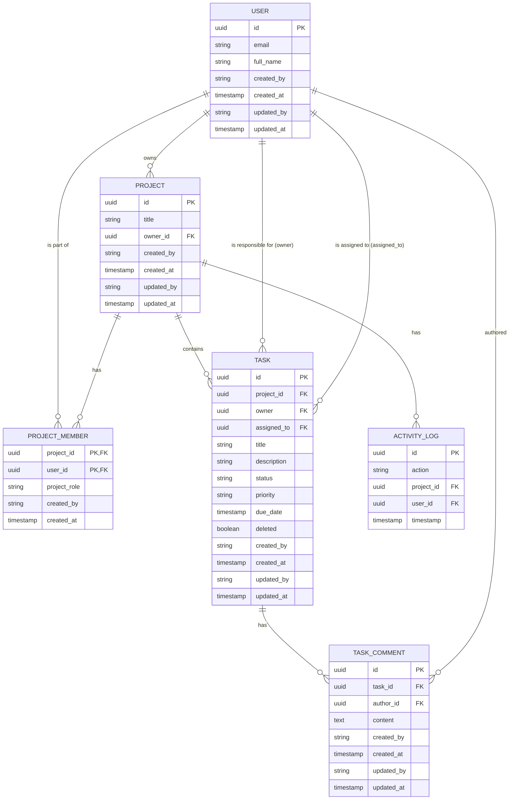

```mermaid
erDiagram
    USER ||--o{ PROJECT : "owns"
    USER ||--o{ PROJECT_MEMBER : "is part of"
    PROJECT ||--o{ PROJECT_MEMBER : "has"
    PROJECT ||--o{ TASK : "contains"
    USER ||--o{ TASK : "is responsible for (owner)"
    USER ||--o{ TASK : "is assigned to (assigned_to)"
    PROJECT ||--o{ ACTIVITY_LOG : "has"
    
    %% New Relationships
    TASK ||--o{ TASK_COMMENT : "has"
    USER ||--o{ TASK_COMMENT : "authored"

    USER {
        uuid id PK
        string email
        string full_name
        string created_by
        timestamp created_at
        string updated_by
        timestamp updated_at
    }

    PROJECT {
        uuid id PK
        string title
        uuid owner_id FK
        string created_by
        timestamp created_at
        string updated_by
        timestamp updated_at
    }

    PROJECT_MEMBER {
        uuid project_id PK, FK
        uuid user_id PK, FK
        string project_role
        string created_by
        timestamp created_at
    }

    TASK {
        uuid id PK
        uuid project_id FK
        uuid owner FK
        uuid assigned_to FK
        string title
        string description
        string status
        string priority
        timestamp due_date
        boolean deleted
        string created_by
        timestamp created_at
        string updated_by
        timestamp updated_at
    }

    TASK_COMMENT {
        uuid id PK
        uuid task_id FK
        uuid author_id FK
        text content
        string created_by
        timestamp created_at
        string updated_by
        timestamp updated_at
    }

    ACTIVITY_LOG {
        uuid id PK
        string action
        uuid project_id FK
        uuid user_id FK
        timestamp timestamp
    }
```