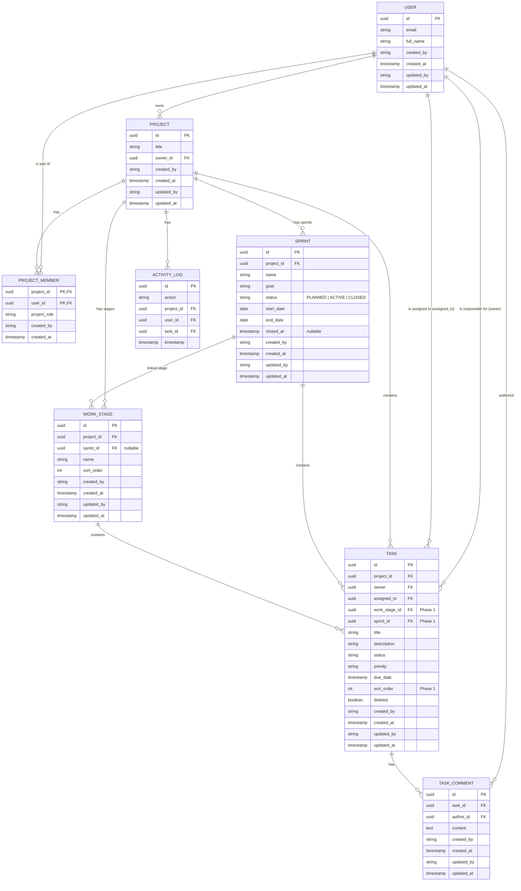

```mermaid
erDiagram
    USER ||--o{ PROJECT : "owns"
    USER ||--o{ PROJECT_MEMBER : "is part of"
    USER ||--o{ TASK : "is responsible for (owner)"
    USER ||--o{ TASK : "is assigned to (assigned_to)"
    USER ||--o{ TASK_COMMENT : "authored"
    
    PROJECT ||--o{ PROJECT_MEMBER : "has"
    PROJECT ||--o{ TASK : "contains"
    PROJECT ||--o{ WORK_STAGE : "has stages"
    PROJECT ||--o{ SPRINT : "has sprints"
    PROJECT ||--o{ ACTIVITY_LOG : "has"

    SPRINT ||--o{ WORK_STAGE : "linked stage"
    SPRINT ||--o{ TASK : "contains"

    WORK_STAGE ||--o{ TASK : "contains"
    
    TASK ||--o{ TASK_COMMENT : "has"

    USER {
        uuid id PK
        string email
        string full_name
        string created_by
        timestamp created_at
        string updated_by
        timestamp updated_at
    }

    PROJECT {
        uuid id PK
        string title
        uuid owner_id FK
        string created_by
        timestamp created_at
        string updated_by
        timestamp updated_at
    }

    PROJECT_MEMBER {
        uuid project_id PK, FK
        uuid user_id PK, FK
        string project_role
        string created_by
        timestamp created_at
    }

    WORK_STAGE {
        uuid id PK
        uuid project_id FK
        uuid sprint_id FK "nullable"
        string name
        int sort_order
        string created_by
        timestamp created_at
        string updated_by
        timestamp updated_at
    }

    SPRINT {
        uuid id PK
        uuid project_id FK
        string name
        string goal
        string status "PLANNED | ACTIVE | CLOSED"
        date start_date
        date end_date
        timestamp closed_at "nullable"
        string created_by
        timestamp created_at
        string updated_by
        timestamp updated_at
    }

    TASK {
        uuid id PK
        uuid project_id FK
        uuid owner FK
        uuid assigned_to FK
        uuid work_stage_id FK "Phase 1"
        uuid sprint_id FK "Phase 1"
        string title
        string description
        string status
        string priority
        timestamp due_date
        int sort_order "Phase 1"
        boolean deleted
        string created_by
        timestamp created_at
        string updated_by
        timestamp updated_at
    }

    TASK_COMMENT {
        uuid id PK
        uuid task_id FK
        uuid author_id FK
        text content
        string created_by
        timestamp created_at
        string updated_by
        timestamp updated_at
    }

    ACTIVITY_LOG {
        uuid id PK
        string action
        uuid project_id FK
        uuid user_id FK
        uuid task_id FK
        timestamp timestamp
    }
```