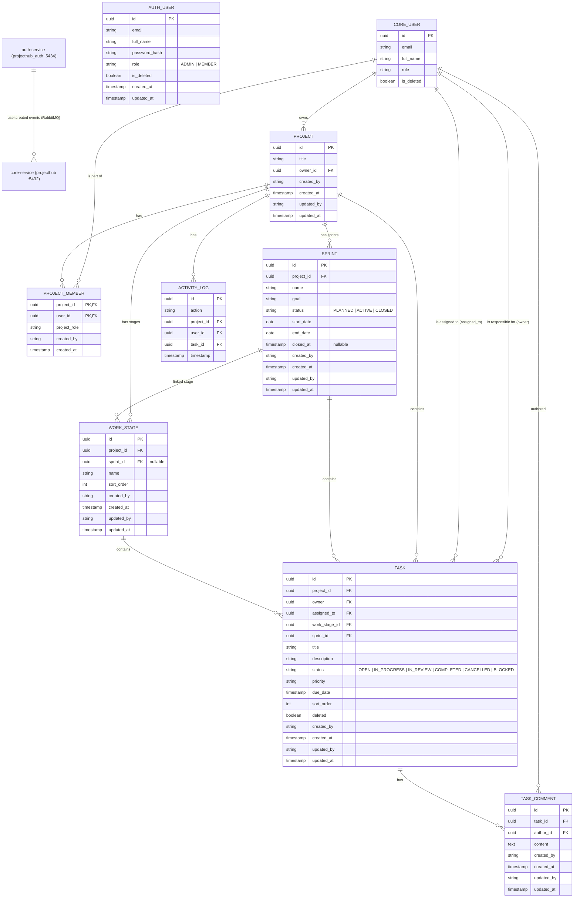
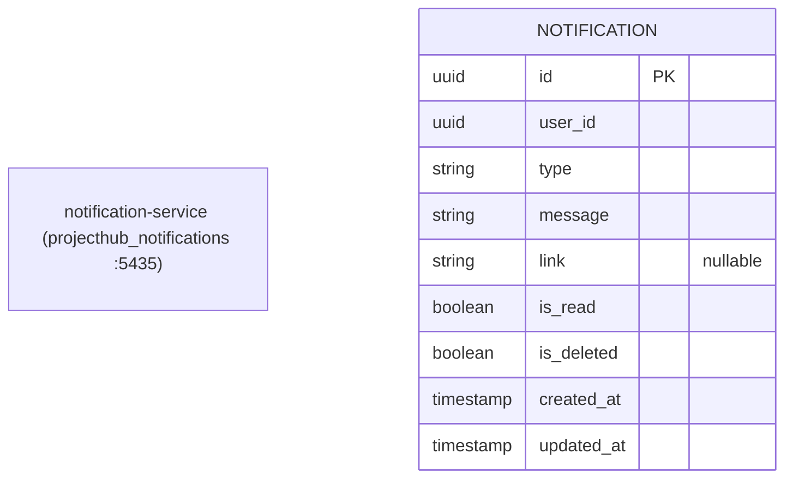

# ERD — Post-Split (Auth + Notification Extracted)

Three databases across three services. Gateway is stateless (no DB).

## Database Ownership

| Database | Port | Service | Tables |
|----------|------|---------|--------|
| `projecthub` | 5432 | core-service | projects, project_members, tasks, task_comments, work_stages, sprints, activity_logs, users (read projection) |
| `projecthub_auth` | 5434 | auth-service | users (auth source of truth) |
| `projecthub_notifications` | 5435 | notification-service | notifications |

## Sync

- **Users**: `auth-service` publishes `user.created` events → RabbitMQ → `core-service` consumes and upserts `core_user` projection
- **Notifications**: `core-service` publishes notification events → RabbitMQ → `notification-service` consumes and inserts into `notifications` table + pushes via WebSocket

---

> **Previous version (monolith):** [erd-v1-monolith.md](erd-v1-monolith.md)
